经过检查，发现之前模拟周期有问题是因为模拟得不够久（总之很快修好了

LG.m: LG model, original, without REV_ERBα

LG_light.m: LG model with v_sP square wave

period_peak.m: calculate period of Per mRNA when the simulation become stable (when to be stable need to be modified by yourself)

LG_fixed.mlx: how to use, standard plot examples, and no PER protein version.

LG_full.m and LG_full_light.m: LG model (full)

LG2.mlx: test for full model

Lyapunov.m, Nullcline.m, Hopf.m are all mathematical analysis

TODO:

adjust params to simulate diseases: FASPS, Non-24-hour sleep-wake syndrome, etc.

ablation experiments: 

**no PER protein:** set k_sP = 0; you may calculate period with other variables?  (DOWN)

It is reported that set $m$ from 2 to 4 can reproduce oscillations.

**no BMAL1-Bmal1 negative feedback:** set K_IB = 100 nM

**add REV_ERBα:** you can find params in fig 8 (support information), and the model has been implemented. Please make some detailed analysis.

ELSE:

Why this model would generate oscillations? How to explain this mathematically? Any analysis can be done using mathematical approach?

**TODO for multi-cell:**

Calculate synchronization index and order parameter.

The pics are too ugly.

# Multi-cell

spatial_weight.m

计算网格上各细胞权重

calculate_eps

计算权重的归一化值

init_params

初始化每个细胞的参数，对k1~k8扰动

init_pre_params

初始化所有方程需要用到的参数

init_v_sP0

初始化每个细胞的v_sP0，进行扰动

init_y

初始化所有方程的y的初始值（可能要改进，不能简单全设为0）

LG_VIP

每个细胞的方程

LG_VIP_total

完整模型方程

LG_VIP_simulate.mlx

模拟脚本

# Overview

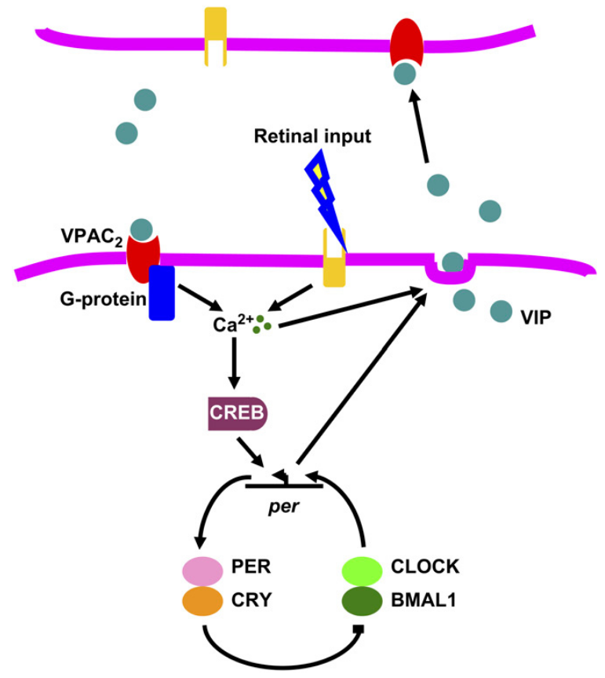

VIP 在光照时持续释放，在黑暗中的释放由 *Per* mRNA 水平控制

VIP 与 G 蛋白偶联受体 VPAC2 结合，增强胞内钙信号，激活 CREB，从而促进 *Per* 转录，使分子钟相位偏移；钙信号也介导了光的相位重置效应和 VIP 的释放

# Detail

**each cell:** LG model

## VIP secretion

light: VIP release rate is constant, sufficiently high to make VPAC2 saturate

dark:

$i$: cell

$\rho$: concentration produced by the cell

$M_P$: `Per` mRNA concentration

$a$: maximum rate

$b$: saturation constant

## spatial organization

use empirical weight factors rather than modelling VIP diffusion

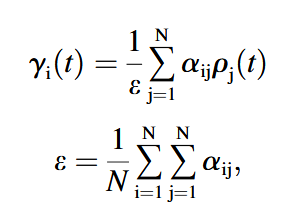

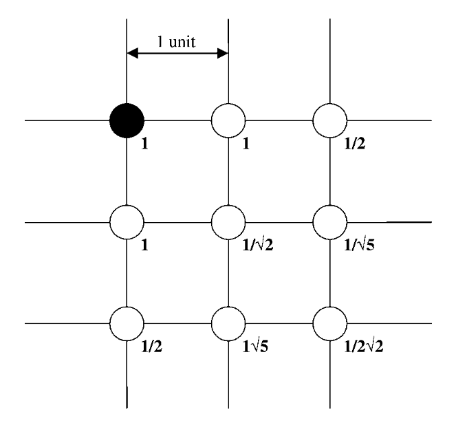

$\gamma_i$: local VIP concentration observed by cell $i$

$\alpha_{ij}$: weighted effect of $j$ on $i$

for two cells that are $m$ units apart, the weight factor is $1/m$; $\alpha_{ii} = 1$

我规定细胞编号1~N，对应坐标：

$Row = \text{ceil}(i/\sqrt{N})$

$Col = i - (Row - 1) * \sqrt{N}$

$\epsilon = 56.70$ for 400 cells was typical in their simulations

## receptor/ligand binding

VIP was assumed to be a monovalent ligand that binds reversibly to the monovalent receptor VPAC2

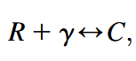

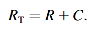

$R$: VPAC2 density

$\gamma$: VIP concentration

$C$: VIP/VPAC2 complex density

$R_T$: total surface receptor density (constant)

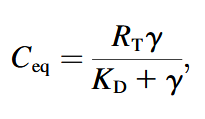

$C_{\text{eq}}$: equilibrium VIP/VPAC2 complex density

$K_D = k_r / k_f$: equilibrium dissociation constant

$\beta$: the extent of receptor saturation; if complete receptor saturation, $\beta = 1$.

## Transduction mechanism

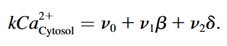

$v_1 \beta$: influx from ligand sensitive pools, $\beta$ is the extent of VIP stimulus (0~1)

$v_2 \delta$: influx from light-sensitive pools, $\delta$ is the extent of light stimulus (0~1)

$v_0$: influx of extracellular Ca2+

$k$: efflux rate of cytosolic Ca2+

The calcium oscillations are ignored due to the timescale.

## Activation of CREB

The activation of protein kinases was omitted from the model.

用胞内钙浓度米氏方程->激酶描述激活，用磷酸酶建模失活

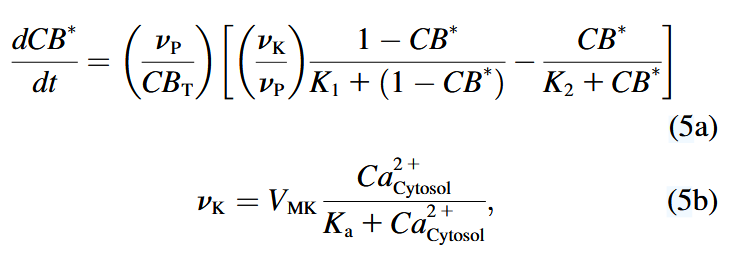

$CB^*$: fraction of phosphorylated CREB / total CREB, denoted as CB_P in the code

$v_K$, $v_P$: maximum rates of kinase and phosphatase activities

$CB_T$: total amount of CREB

$V_{MK}$: maximum rate of activation by Ca2+

$K_1$, $K_2$, $K_a$: threshold constants

## CREB binding to *Per* gene

This is modeled analogous as VPAC2 binding. 

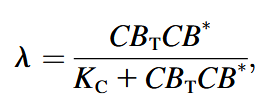

$\lambda$: the extent of CREB activation (0~1)

$K_C$: the dissociation constant

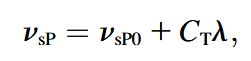

$v_{sP}$: transcription rate of *Per* gene

$v_{sP0}$: basal transcription rate of *Per* gene

$C_T$: scaled maximum effect of CREB-binding

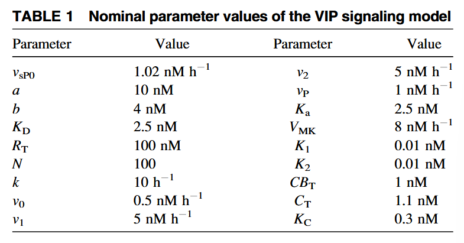

## Simulation cost

A complete cell model obtained by augmenting the core oscillator with intercellular signaling was comprised of 17 ordinary differential equations plus 5 algebraic equations. Simulations utilized 400 cells placed on a $20\times20$ grid, resulting in a multicellular model with 6800 ordinary differential equations.

## Asynchronous initalization

Henson, M. A. 2004. Modeling the synchronization of yeast respiratory oscillation. J. Theor. Biol. 231:443–458.

Assign a randomly perturbed value of $v_{sP0}$ and $k_1$~$k_8$ for each neuron, such that ~40% of the cells produced sustained oscillations in the absence of VIP coupling.

The free-running periods should be tightly distributed around 22 h.

$\sigma_1$: standard deviation of $v_{sP0}$, ~10%

$\sigma_2$: standard deviation of $k_i$, ~20%

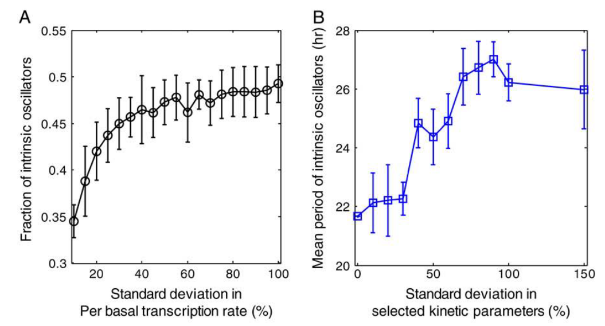

Let the initial value of all variables to be 0 is fine.

## Measure the instantaneous degree

Measure after each oscillation cycle (every 24 h?)

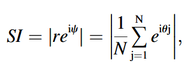

$SI$: synchronization index (0, no sync; 1, perfect sync)

$\psi$: average phase

$\theta_j$: phase of the $j$-th cell

$|\cdot|$: modulus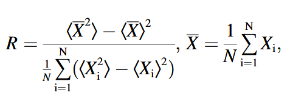

$R$: order parameter, measure the overall degree of synchrony over a specified time period (0, complete asynchrony; 1, complete sync)

$\left \langle \cdot \right \rangle $: average over time

$X$: any variable of the cell model, e.g., *Per* mRNA level

All $R$ values were computed over a time period of 120 h (5 days).

## Modelling the loss of VIP signaling (e.g.)

set $\beta = 0$ at $t = 72$ h

## Modelling LD entrainment

light: $\delta = 1$

dark: $\delta = 0$

change $\delta$ every 12 h

